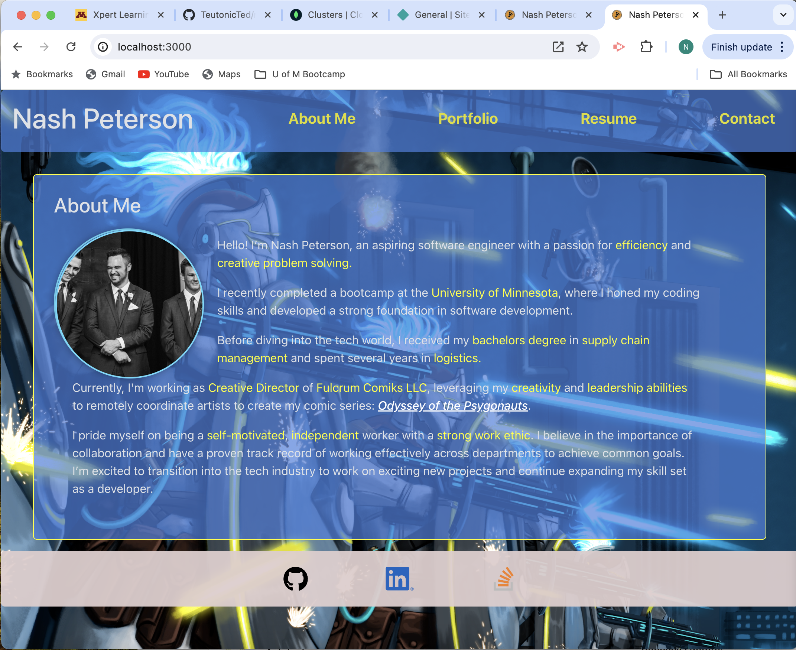

# Nash Peterson's Developer Portfolio (React)

Applying all the concepts from the cohort, I created my portfolio with the following functionalities:

### React

Installed all node packages and imported necessary functions (React, Link,  useState, useEffect) to enable React application to run smoothly.

In short, this application uses React to generate, navigate & share data for multiple pages from a single App.jsx file.

Using images from Fulcrum Comiks, LLC (my company) for the background image and favicon.

Currently, two official plugins are available (provided by my instructor):

- [@vitejs/plugin-react](https://github.com/vitejs/vite-plugin-react/blob/main/packages/plugin-react/README.md) uses [Babel](https://babeljs.io/) for Fast Refresh
- [@vitejs/plugin-react-swc](https://github.com/vitejs/vite-plugin-react-swc) uses [SWC](https://swc.rs/) for Fast Refresh

### Components
- Header
    - Map the nav items from the menu array to link the application pages (across all pages).
- Main
    - Generate the main view for the "/" page (from AboutPage)
- Project
    - Map items from the project array to generate the project cards (inside PortfolioPage)
- Footer 
    - Map items from Links array to generate the icons and links for my social links (across all pages)

### Pages
Routed through the App.jsx file, the following pages:

- AboutPage
    - Display my profile thumbnail and bio. 

- PortfolioPage
    - Display my 6 projects (linking my GitHub repo & deployed application)
        **PLEASE NOTE: Some of these projects aren't deployed. In their place are walkthrough videos displaying the functionality of the project's code.

- ResumePage
    - Display my dev skills and topics I have worked in.
    - A DOM element button - allowing a downloadable copy of my resume on your machine.

- ContactPage
    - Display form fields to collect name, email & message for those who wish to contact me.
    - Deployed with validators to ensure:
        - All fields are filled out (error message displays)
        - A valid email is entered (using a regex)
        ** PLEASE NOTE: Form field save user data to local storage. Adding GraphQL functionality to collect user data is in progress.  

## Screenshot 

## Link to Deployed Application

[Click here to visit the deployed application](https://curious-hummingbird-98f858.netlify.app/)

